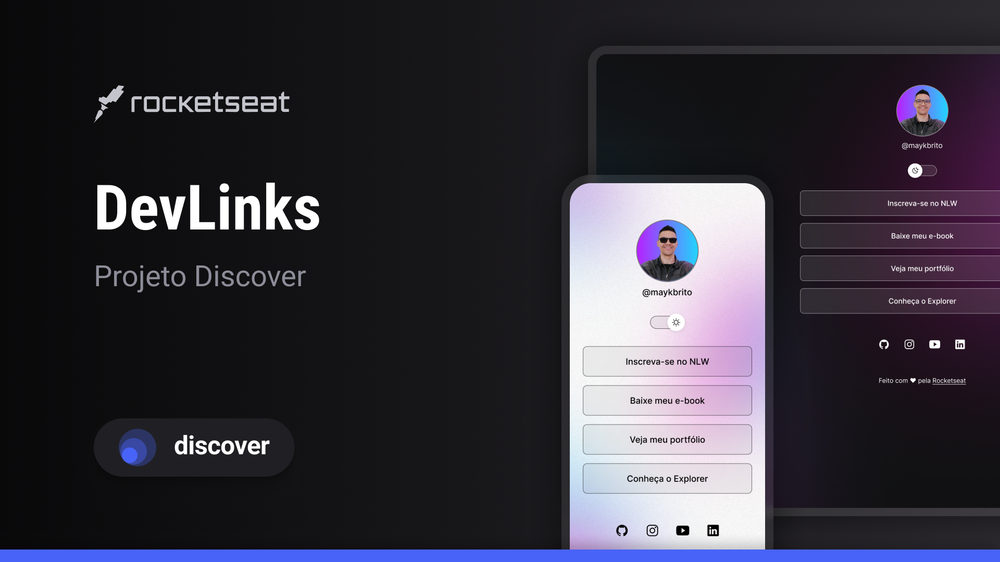

<h1 align="center">Devlinks </h1>

Programa exclusivo e gratuito, promovido pela Rocketseat para ensino de tecnologias WEB.

<a href="#-tecnologias">Tecnologias</a>&nbsp;&nbsp;&nbsp;|&nbsp;&nbsp;&nbsp;
<a href="#-projeto">Projeto</a>&nbsp;&nbsp;&nbsp;|&nbsp;&nbsp;&nbsp;
<a href="#-layout">Layout</a>&nbsp;&nbsp;&nbsp;|&nbsp;&nbsp;&nbsp;
<a href="#-licenca">Licença</a>

 

## 🚀 Tecnologias

Esse projeto foi desenvolvido com as seguintes tecnologias:

- HTML e css
- github
- JavaScript
- Figma

## Projeto
O Deve links é um agregador de links para usar como cartão de visitas onlines.

## layout
Você pode visualizar o layout do projeto através [DESSE LINK](https://www.figma.com/design/FHO6rINS0pE9h5LUbbMyM6/DevLinks-%E2%80%A2-Projeto-Discover--Community-?node-id=1437-191&p=f&t=5mvCiPW1oXBQEbJ3-0) É necessário ter conta no [figma](HTTPS://figma.com) para acessá-lo.

## :memo: lincença
Este projeto está sob a lincença do MIT

Feito com amor by Rockeseat :wave: [Participe da nossa comunidade]
(https://discord.gg/Rockeseat)
